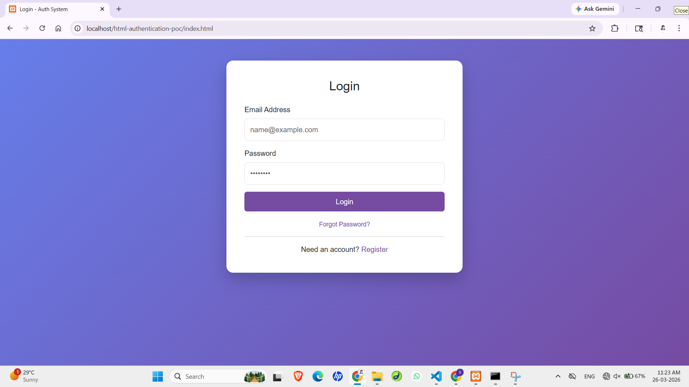
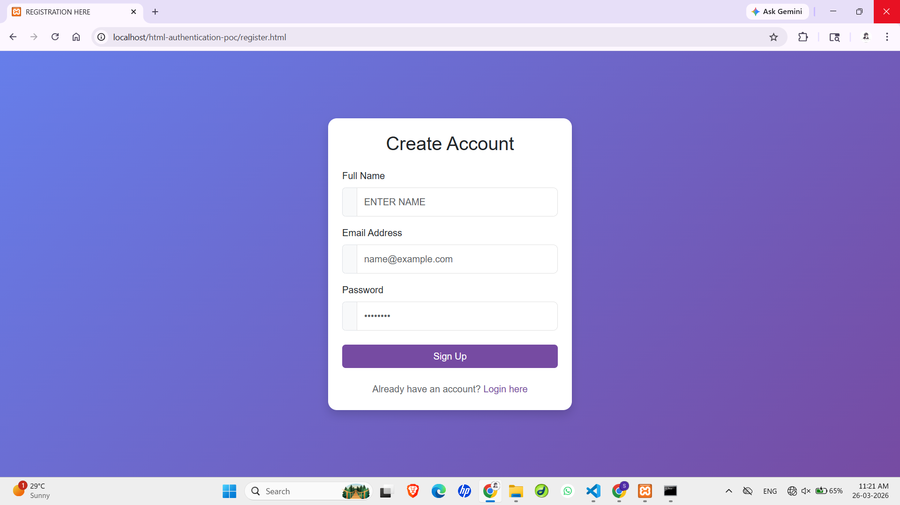
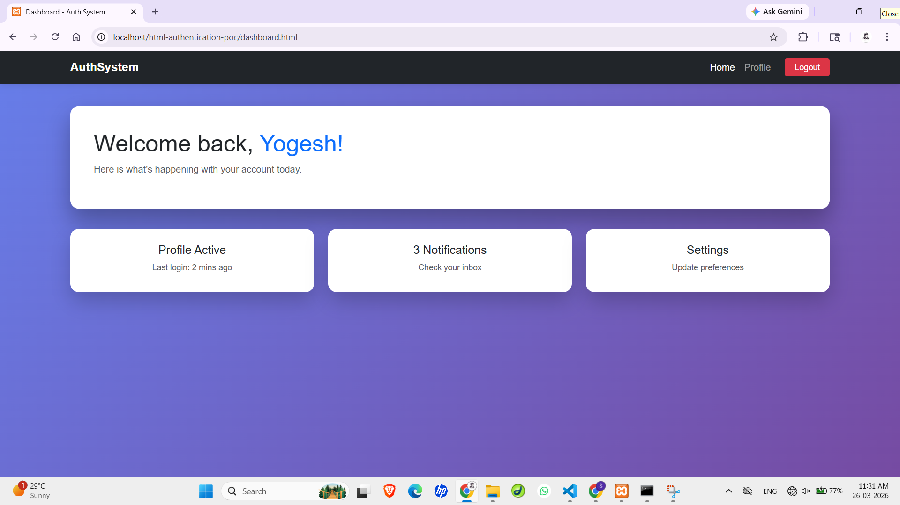
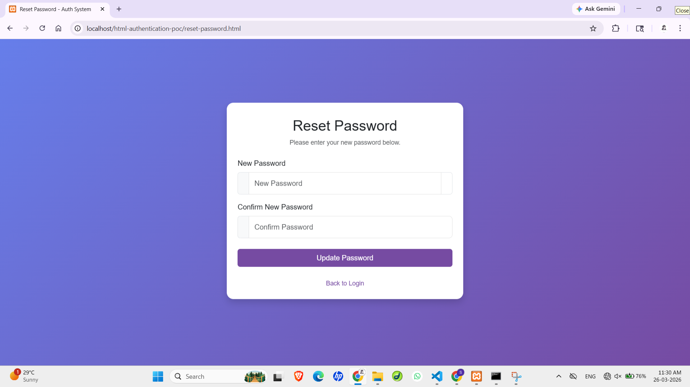
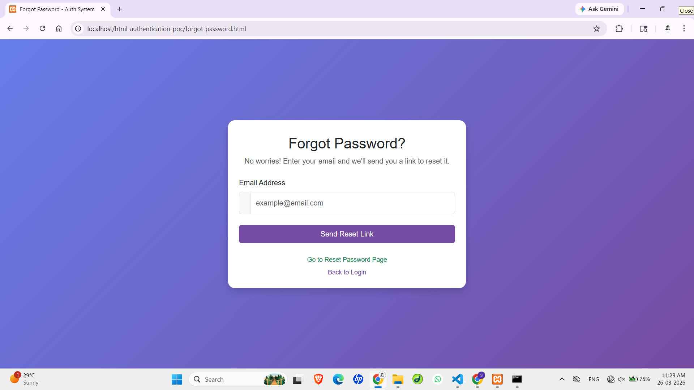

It has been upgraded from plain HTML to a modern web interface using **Bootstrap 5**, **Custom CSS3**, and **Google Fonts**.

📁 Project Structure
- `index.html`: The main Login page (centered card layout).
- `register.html`: Account creation form with input groups.
- `forgot-password.html`: Email recovery interface.
- `reset-password.html`: New password entry with visibility toggle icons.
- `dashboard.html`: User landing area with a responsive Navbar and Logout functionality.
- `styles.css`: Custom styling for gradients, animations, and box shadows.
- `/screenshots`: Folder containing visual previews of all pages.

## 🛠️ Tech Stack
- **HTML5**: Semantic structure.
- **Bootstrap 5.3**: Layout and components.
- **CSS3**: Custom variables, gradients, and transitions.
- **Bootstrap Icons**: Visual cues for form inputs.

## 📸 Visual Previews
| **Login** | 
| **Register** | 
| **Dashboard** | 
| **reset-password** | 
| **forgot-password** | 